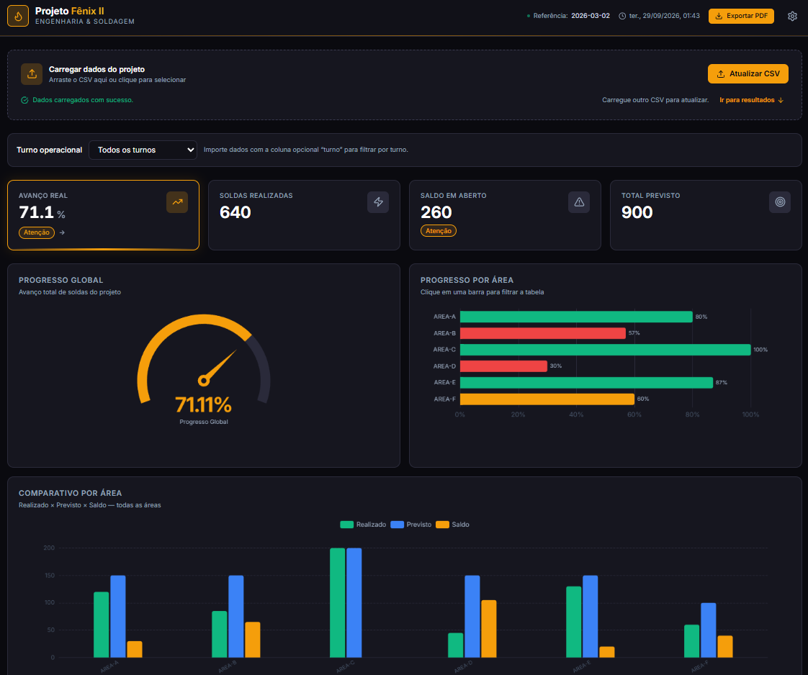

# Fênix II — Dashboard de Monitoramento de Soldagem


[](https://fenix-dashboard.vercel.app/)

O **Fênix II Dashboard** é uma aplicação web de alta performance para monitoramento
em tempo real de métricas de soldagem por área. Permite importar dados via CSV,
visualizar KPIs, gráficos e tabelas interativas, e exportar relatórios em PDF e PNG
através de um servidor headless Chromium (Playwright).

🌐 **[Acessar o Dashboard](https://fenix-dashboard.vercel.app/)**



---

## 📋 Sumário

- [Funcionalidades](#-funcionalidades)
- [Tecnologias](#-tecnologias)
- [Pré-requisitos](#-pré-requisitos)
- [Instalação](#-instalação)
- [Scripts Disponíveis](#-scripts-disponíveis)
- [Testes](#-testes)
- [Tempo real, alertas e operação offline](#-tempo-real-alertas-e-operação-offline)
- [Formato do CSV](#-formato-do-csv)
- [Serviço de Exportação PDF/PNG](#-serviço-de-exportação-pdfpng)
- [Estrutura do Projeto](#-estrutura-do-projeto)
- [Deploy](#-deploy)
- [Licença](#-licença)
- [Autor](#-autor)

---

## ✨ Funcionalidades

- 📡 **Ingestão MQTT/WebSocket/SSE em tempo real** por WebSocket seguro, com validação dos payloads e persistência local
- 🔔 **Alertas configuráveis** por limiar, com notificações do navegador e webhook no servidor
- 📶 **PWA offline-first** — interface em cache e dados/settings no IndexedDB (Dexie)
- 🧾 **Exportação client-side** em PDF/PNG quando a API Playwright estiver indisponível
- 📂 **Importação de CSV** com drag-and-drop, validação de schema (Zod) e feedback visual
- 📊 **KPIs automáticos** — soldas realizadas, saldo, percentual de conclusão por área
- 📈 **Gráficos interativos** — barras, gauge e histórico (ECharts)
- 🧭 **Filtro por turno** — segmentação dos dados por turnos A, B e C
- 🛑 **Análise de paradas** — motivo, duração, turno e contagem de retrabalho
- 🔮 **Previsão de conclusão** por área usando regressão linear de snapshots históricos
- 🌡️ **Heatmap de produtividade** por área e dia da semana
- 📋 **Tabela de dados** com ordenação, filtro por área e visibilidade de colunas configurável
- ⚙️ **Painel de configurações** com entrada manual de dados e exportação de CSV modelo
- 🧰 **Ferramentas opcionais** — conexões, alertas e paradas só aparecem quando ativados
- 🖨️ **Exportação de relatórios** em PDF e PNG via servidor Playwright (headless Chromium)
- 💾 **Cache persistente** de dados entre sessões (TanStack Query)
- 🔒 **Tipagem estrita** em todo o projeto (TypeScript 5 + ESLint 9)

---

## 🛠 Tecnologias

| Biblioteca | Versão | Papel no projeto |
|---|---|---|
| [React](https://react.dev/) | 19 | Biblioteca principal de UI |
| [Dexie.js](https://dexie.org/) | 4 | Persistência local em IndexedDB |
| [MQTT.js](https://github.com/mqttjs/MQTT.js) | 5 | Ingestão em tempo real via WebSocket |
| [vite-plugin-pwa](https://github.com/vite-pwa/vite-plugin-pwa) | 1 | Manifesto e service worker da PWA |
| [Vite](https://vitejs.dev/) | 6 | Bundler e servidor de desenvolvimento |
| [TypeScript](https://www.typescriptlang.org/) | 5 | Tipagem estática |
| [TanStack Query](https://tanstack.com/query/v5) | 5 | Cache, estado assíncrono e persistência |
| [ECharts](https://echarts.apache.org/) | 5 | Renderização de gráficos |
| [PapaParse](https://www.papaparse.com/) | 5 | Parsing e geração de CSV |
| [Zod](https://zod.dev/) | 3 | Validação de schema e inferência de tipos |
| [Tailwind CSS](https://tailwindcss.com/) | 4 | Estilização utility-first com integração Vite |
| [Vitest](https://vitest.dev/) | 5 | Testes unitários e de componentes |
| [React Testing Library](https://testing-library.com/docs/react-testing-library/intro/) | 16 | Testes de interação React |
| [Vercel Analytics](https://vercel.com/docs/analytics/quickstart) | 2 | Métricas de visitas e visualizações |
| [Lucide React](https://lucide.dev/) | latest | Ícones SVG |
| [Playwright](https://playwright.dev/) | 1 | Exportação PDF/PNG headless |
| [ESLint](https://eslint.org/) | 9 | Linting (Flat Config) |

---

## ⚙️ Pré-requisitos

- [Node.js](https://nodejs.org/) `>= 20` e `< 25`
- `npm` (incluso com o Node.js)

---

## 🚀 Instalação

```bash
# 1. Clone o repositório
git clone https://github.com/alberto2santos/fenix-dashboard.git
cd fenix-dashboard

# 2. Instale as dependências
npm install

# 3. Instale o Chromium do Playwright (necessário para exportação PDF/PNG)
npx playwright install chromium

# 4. Inicie o servidor de desenvolvimento
npm run dev
```

Acesse em: `http://localhost:5173`

---

## 💻 Scripts Disponíveis

| Comando | Descrição |
|---|---|
| `npm run dev` | Inicia o servidor de desenvolvimento (Vite) |
| `npm run build` | Gera o build de produção na pasta `dist/` |
| `npm run preview` | Serve o build de produção localmente |
| `npm run server` | Inicia o servidor de exportação PDF/PNG (porta 3001) |
| `npm run test` | Executa testes unitários e de componentes com Vitest |
| `npm run test:watch` | Executa Vitest em modo interativo |
| `npm run test:e2e` | Executa os fluxos E2E em Chromium com Playwright |
| `npm run lint` | Executa o ESLint — zero warnings permitidos |
| `npm run type-check` | Verifica tipos TypeScript sem compilar |
| `npm run analyze` | Gera relatório visual do tamanho do bundle |
| `npm run audit` | Audita vulnerabilidades nas dependências |

---

## 🧪 Testes

Os testes de unidade e componentes cobrem os cálculos de histórico e KPIs, além
da importação de CSV com linhas inválidas. O E2E usa o Google Chrome instalado
no sistema e executa o fluxo de CSV até a exportação PDF local.

---

## 🔌 Tempo real, alertas e operação offline

O painel oferece três transportes de snapshots JSON: MQTT sobre WebSocket, WebSocket direto e Server-Sent Events (SSE). MQTT exige um tópico; WebSocket e SSE recebem mensagens JSON diretamente. Em páginas HTTPS, use WSS ou HTTPS. Credenciais MQTT ficam apenas na memória da aba e não são salvas no IndexedDB.

As ferramentas de conexão, alertas e registro de paradas ficam desativadas por padrão. Abra **Ferramentas opcionais** no fim da página e ative apenas o que for usar; a escolha fica salva neste navegador.

Os alertas comparam o avanço acumulado com o limiar geral ou com limites individuais configurados por área. O envio pode usar notificações do navegador ou webhook. Para enviar eventos a Slack, Microsoft Teams, WhatsApp Cloud API ou um endpoint customizado, configure variáveis no ambiente do servidor/Vercel. Os segredos não devem usar o prefixo `VITE_`.

| Variável | Uso |
|---|---|
| `ALERT_WEBHOOK_PROVIDER` | `slack`, `teams`, `whatsapp` ou `custom` |
| `ALERT_WEBHOOK_URL` | URL do webhook ou endpoint de mensagens do WhatsApp Cloud API |
| `ALERT_WEBHOOK_TOKEN` | Token opcional do endpoint; obrigatório para WhatsApp |
| `ALERT_WEBHOOK_TO` | Número destinatário exigido pelo WhatsApp Cloud API |

O service worker mantém os arquivos da aplicação disponíveis offline. Snapshots,
paradas e configurações ficam neste navegador/dispositivo via IndexedDB; para
sincronizar vários dispositivos, conecte um broker ou backend que distribua os dados.

---

## 📄 Formato do CSV

O dashboard aceita arquivos `.csv` com o seguinte formato:

```csv
area,soldas_realizadas,saldo_soldas,total_previsto,porcentagem,data_referencia,turno
AREA-A,120,30,150,0.80,2026-03-02,A
AREA-B,85,65,150,0.57,2026-03-02,B
AREA-C,200,0,200,1.00,2026-03-02,C
```

Os registros podem conter várias datas para a mesma área. `soldas_realizadas`
deve ser o total acumulado naquela data; a previsão e o heatmap precisam de pelo
menos duas datas por área. A coluna opcional `turno` aceita `A`, `B` ou `C`.
Registros no mesmo turno e data substituem a versão anterior daquele snapshot.

> 💡 Um arquivo modelo pode ser baixado diretamente pela interface do dashboard,
> no painel de configurações, aba **Importar CSV → Baixar modelo**.

**Campos obrigatórios:**

| Campo | Tipo | Descrição |
|---|---|---|
| `area` | `string` | Identificador da área |
| `soldas_realizadas` | `number` | Quantidade de soldas concluídas |
| `saldo_soldas` | `number` | Soldas restantes para a meta |
| `total_previsto` | `number` | Meta total de soldas |
| `porcentagem` | `number` | Percentual de conclusão (`0.0` a `1.0`) |
| `data_referencia` | `string` | Data no formato `YYYY-MM-DD` (opcional) |
| `turno` | `string` | Turno `A`, `B` ou `C` (opcional) |

---

## 🖨️ Serviço de Exportação PDF/PNG

O dashboard possui um servidor Node.js dedicado que utiliza o **Playwright
(Chromium headless)** para capturar os gráficos e gerar relatórios vetoriais.

**Para utilizar a exportação:**

```bash
# Terminal 1 — aplicação principal
npm run dev

# Terminal 2 — servidor de exportação
npm run server
```

O servidor sobe na porta `3001` e expõe o endpoint:

```
POST http://localhost:3001/api/export
Content-Type: application/json

{
  "url":      "http://localhost:5173",
  "format":   "pdf",              // "pdf" ou "png"
  "filename": "fenix-relatorio"
}
```

> ⚠️ O servidor aguarda a renderização completa dos gráficos ECharts
> antes de gerar o buffer — nenhum dado é cortado na exportação.

---

## 📁 Estrutura do Projeto

```
fenix-dashboard/
├── api/
│   └── alerts.ts
├── public/
│   └── fenix-icon.svg
├── server/
│   └── export.js              # Servidor Playwright (PDF/PNG)
├── src/
│   ├── assets/fonts/
│   │   └── Inter-Variable.woff2
│   ├── components/
│   │   ├── AlertBadge/
│   │   ├── AlertSettings/
│   │   ├── AppFooter/
│   │   ├── AppHeader/
│   │   ├── BarChart/
│   │   ├── ChartsSection/
│   │   ├── DataTable/
│   │   ├── DowntimeSection/
│   │   ├── ForecastPanel/
│   │   ├── GaugeChart/
│   │   ├── HistoryChart/
│   │   ├── KpiCard/
│   │   ├── ProductivityHeatmap/
│   │   ├── RealtimeIngestion/
│   │   ├── SettingsDrawer/
│   │   │   ├── tabs/          # ColumnsTab, CsvTab, ManualEntryTab
│   │   │   ├── index.ts
│   │   │   ├── SettingsDrawer.tsx
│   │   │   └── SettingsDrawer.types.ts
│   │   ├── ShiftFilter/
│   │   ├── charts/
│   │   └── UploadSection/
│   ├── db/
│   │   └── dashboardDb.ts
│   ├── hooks/
│   │   ├── useCsvParser.ts
│   │   ├── useDashboardData.ts
│   │   └── useSettings.ts
│   ├── schemas/
│   │   ├── downtimeSchema.ts
│   │   ├── settingsSchema.ts
│   │   └── soldaSchema.ts
│   ├── utils/
│   │   ├── colorRules.ts
│   │   ├── exportPdf.ts
│   │   └── snapshotHistory.ts
│   ├── App.tsx
│   ├── main.tsx
│   └── index.css
├── eslint.config.js
├── playwright.config.ts
├── vitest.config.ts
├── tsconfig.app.json
├── tsconfig.node.json
├── vite.config.ts
└── package.json
```

---

## 🌐 Deploy

O projeto está publicado na **Vercel**:

🔗 **[https://fenix-dashboard.vercel.app/](https://fenix-dashboard.vercel.app/)**

Para rodar o build de produção localmente:

```bash
npm run build
npm run preview
```

> ⚠️ O servidor de exportação (`server/export.js`) requer um ambiente
> Node.js com suporte a Playwright — não é compatível com deploy estático.
> Para produção, considere uma instância dedicada (ex: Railway, Render, VPS).

---

## 📜 Licença

Este projeto está licenciado sob a **MIT License**.
Consulte o arquivo [LICENSE](LICENSE) para mais detalhes.

---

## ✒️ Autor

**Alberto Luiz**

[](https://github.com/alberto2santos)
[](mailto:alberto.dos.santos93@gmail.com)

---
